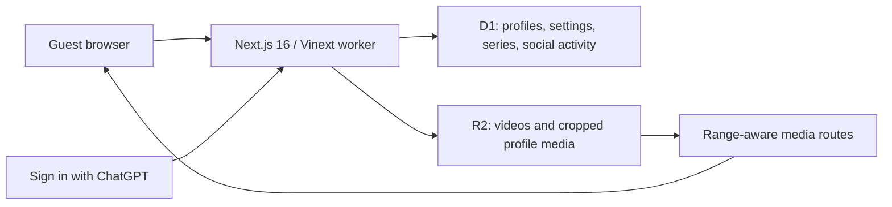

<div align="center">
  <h1> Pumblo</h1>
  <p><strong>The creator-owned home for AI video after the render.</strong></p>
  <p>Watch, publish, organize, and discuss AI-made video across toolsnot inside one generator's gallery.</p>

  <a href="https://www.typescriptlang.org/"></a>
  <a href="LICENSE"></a>
  <br />
  <a href="https://nextjs.org/"></a>
  <a href="#-capacity--hosting"></a>
  <br />
  <strong><a href="https://pumblo-ai-video.oumaribrahim123.chatgpt.site">Open Pumblo</a></strong>
</div>

<p align="center">
  
</p>

> [!IMPORTANT]
> **No card setup path.** Local development needs no API keys. The checked-in Sites project supplies production authentication, D1, and R2. "Free" is a current deployment conditionnot a promise that any provider's quotas or pricing will remain unchanged.

```powershell
# Quickstart  Windows PowerShell
git clone https://github.com/IamOumarIbrahim/pumblo.git
cd pumblo
.\scripts\setup.ps1
npm run dev
```

**The problem:** AI video generators are good at producing files, but a render trapped inside one generator's private gallery never becomes a channel, a story, or an audienceit gets watched once, by the person who made it, and then it's gone.

**Why Pumblo exists:** AI-made video needed a home after generation stopsone place to publish and follow work regardless of which tool made it, instead of a different disconnected gallery per generator.

Pumblo turns scattered renders into channels, series, and audiences by giving every video a public, searchable page with transparent limits and a permanent link. It's built for creators publishing AI video who want people to come backnot for general (non-AI) video hosting, and not as a replacement for any generation tool itself.

<br />

## Table of Contents

- [What is Pumblo?](#-what-is-pumblo)
- [Key Features](#-key-features)
- [Feedback Roadmap](ROADMAP.md)
- [Creator ranks](#creator-ranks)
- [System Architecture](#️-system-architecture)
- [Setup & Installation](#-setup--installation)
- [How to Use](#️-how-to-use)
- [Capacity & Hosting](#-capacity--hosting)
- [Runtime Reference](#-runtime-reference)
- [Product Gates](#-product-gates)
- [Scope & Limitations](#-scope--limitations)
- [File Structure](#-file-structure)
- [Troubleshooting](#-troubleshooting)
- [Contributing](#-contributing)
- [License](#-license)

---

## What is Pumblo?

Most AI-video workflows end at the export button: the file lands in a generator's own history, gets downloaded once, and rarely finds a second viewer. Pumblo exists for what happens after that exportturning a folder of standalone clips into a channel other people can actually find, follow, and return to.

| Before | After |
| :--- | :--- |
| A finished render sits in a generator's private gallery, visible only to the person who made it, with no link to anything else they've made | The same render gets a public, searchable page with a canonical URL, and can join a numbered series that viewers follow episode to episode |

Instead of optimizing only for disconnected clips, Pumblo supports three viewing loops:

- **Discover**: trending, latest, category, Following, search, and vertical Quicks feeds.
- **Follow a story**: numbered series pages, resume progress, and next-episode playback.
- **Support a creator**: profiles, follows, likes, comments, notifications, and shareable canonical URLs.

"Behind the render" remains optional context. Tool, workflow, prompt, license, and source-credit fields support the video; they are not the main product.

---

## Key Features

- ▶️ **Hover previews**: desktop video cards preview inline on pointer hover. Pumblo requests sound and falls back to muted playback with a one-click sound control when browser autoplay policy blocks it.
-  **Quicks**: videos strictly shorter than 60 seconds enter a vertical, paginated feed with keyboard and on-screen navigation.
- ️ **Series and episodes**: creators organize videos by season and episode; viewers get ordered series pages and optional next-episode autoplay.
-  **Creator ranks**: Rising, Active, and Storyteller use transparent publishing-structure rules without pretending to judge artistic quality.
-  **Continue Watching**: signed-in viewers resume from persisted playback progress.
-  **Watch Later**: one-click private saving creates a personal library.
-  **Creator Studio**: views, likes, comments, published runtime, storage, per-video performance, series management, and rank evidence live together.
-  **Activity inbox**: configurable notifications cover likes, comments, follows, and new series episodes.
-  **Reporting intake**: signed-in viewers can report rights, impersonation, non-consensual, hate, spam, or other concerns once per video.
- ️ **Local storage optimizer**: optional, conservative WebM re-encoding runs in the browser and is kept only if it saves more than 8% while preserving runtime.
-  **Creator profiles**: cropped avatar/banner CRUD, bio/location/site fields, plus optional ChatGPT, Discord, X, GitHub, and YouTube links.
- ️ **Settings**: playback/performance, data saver, reduced motion, content preferences, notifications, public-profile privacy, and a JSON account export.
-  **Queryable public web**: search APIs, canonical video/profile/series URLs, `VideoObject` structured data, XML sitemap, robots rules, manifest, and share metadata.
-  **Guest-first access**: viewing requires no account. Sign in with ChatGPT appears only when someone tries to publish or interact.
-  **Threaded conversation**: three-level replies support one like/dislike vote per profile, visible counts, and creator-rank badges.
-  **Guided batch import**: new channels can select multiple original MP4/WebM files, review still previews and titles, and stay within the 80 MB capacity bar before uploading.

---

## Creator ranks

Creator ranks measure publishing structure—not identity, popularity, truth, or artistic quality.

| Rank | Server-checkable requirements |
| :--- | :--- |
| Rising | Fewer than 3 published videos |
| Active | 3 or more published videos |
| Storyteller | At least one qualifying series with 3 consecutive episodes of at least 60 seconds each |

A qualifying series contains a season with at least three consecutive episodes, every counted episode is at least 60 seconds, and its season numbering has no gaps or duplicates. Abuse resistance is enforced through server-generated publication timestamps, server-read MP4/WebM runtimes, a unique series/season/episode index, and a per-channel duplicate-file hash. The rules and evidence are visible in Creator Studio.

---

## ️ System Architecture

The browser talks to one edge worker. Sites supplies identity, D1, and R2.



> [!NOTE]
> **Two-stage upload validation:** the raw request body streams into R2. The worker then reads the capped stored object to verify its container runtime, video track, exact byte size, and SHA-256 duplicate hash before publishing metadata. No multipart video is buffered before storage.

See [`docs/architecture.md`](docs/architecture.md) for the detailed trust and data boundaries.

---

## Setup & Installation

### Option A: Automated setup

Windows PowerShell:

```powershell
.\scripts\setup.ps1
```

macOS / Linux:

```bash
chmod +x scripts/setup.sh
./scripts/setup.sh
```

Both scripts check Node.js, install the lockfile, run release gates, and build the worker.

### Option B: Manual installation

Requirements: Node.js 22.13 or newer and npm.

```bash
npm ci
npm run verify
npm run dev
```

No `.env` is required. Local D1/R2 state lives under this repository's `.wrangler/` directory.

 **Verification command**

```bash
npm run verify
```

Expected result: ESLint, TypeScript, all unit/release gates, the production dependency audit, and the Vinext production build pass.

### Production deployment

The checked-in [`.openai/hosting.json`](.openai/hosting.json) targets the existing Pumblo Sites project with D1 as `DB` and R2 as `MEDIA`. Deploy through Codex Sites; this configured path does not ask the repository owner to create a registrar, database, object-storage, OAuth, or payment-card account.

Live domain: **[pumblo-ai-video.oumaribrahim123.chatgpt.site](https://pumblo-ai-video.oumaribrahim123.chatgpt.site)**

---

## ️ How to Use

1. Browse, search, hover-preview videos, or scroll Quicks without signing in.
2. Choose a write action, continue with ChatGPT, and claim a creator handle.
3. Add optional cropped profile media, creator links, privacy, playback, and notification settings.
4. Create a series in Studio when the video belongs to a connected story.
5. Choose an MP4/WebM source up to 200 MiB; optionally optimize it locally, then publish a final file no larger than 40 MiB and within the channel's remaining 80 MiB.
6. Use another profile to watch/resume, save, like, comment, follow, receive notifications, and report content where necessary.

For a local two-person acceptance test:

```text
http://localhost:3000/api/dev-session?email=alice@example.test
http://localhost:3000/api/dev-session?email=bob@example.test
```

The helper route returns `404` outside development.

---

## Capacity & Hosting

The launch envelope is explicit and test-enforced:

```text
100 creators × (80 MiB total video + 2 profile images × 3 MiB)
= 8,600 MiB maximum modeled media payload
```

Each creator has 12 active video slots, but the 80 MiB channel totalnot `12 × 40 MiB`is the controlling storage bound. A single published file is capped at 40 MiB. This lets creators publish multi-part stories while keeping the 100-creator video envelope at 8,000 MiB; profile media adds at most 600 MiB.

For comparison, Cloudflare currently publishes 10 GB-month of Standard R2 storage, 1 million Class A operations, 10 million Class B operations, and free Internet egress in its monthly free tier. D1 Free currently publishes 5 GB storage, 5 million rows read/day, and 100,000 rows written/day; Workers Free publishes 100,000 requests/day. Those direct-product limits are useful capacity benchmarks, but they do not prove that Sites-managed bindings inherit identical terms. See [`docs/HOSTING-100-USERS.md`](docs/HOSTING-100-USERS.md) for dated official sources and caveats.

There is no application-level signup cap. "100 creators" is a bounded storage design targetnot a claim of 100 simultaneous uploads, guaranteed uptime, permanent zero pricing, or unlimited playback.

---

## Runtime Reference

| Resource | Limit / behavior |
| :--- | :--- |
| Profiles | No application-level count cap |
| Video slots | 12 active videos per creator |
| Channel video storage | 80 MiB total |
| Published video | MP4/WebM, 40 MiB maximum, six-hour maximum runtime |
| Optimizer source | MP4/WebM, 200 MiB maximum; local, optional, real-time |
| Quicks | Runtime greater than 0 and strictly below 60 seconds |
| Story episode | At least 60 seconds to count toward Storyteller rank |
| Profile images | JPEG/PNG/WebP crop, 3 MiB each; 512 × 512 avatar and 1600 × 480 banner |
| Authentication | Sign in with ChatGPT for writes; guest viewing stays public |
| Social links | Public profile URLs, not OAuth connections or endorsements |
| AI/process status | `creator-declared`; not forensic proof |

Public routes: [`docs/api.md`](docs/api.md).

---

## Product Gates

Every market-facing change must survive one blunt question: **"Bro, who's even gonna use this?"**

| Gate | Shipping test |
| :--- | :--- |
| Named audience | Does this help someone making or intentionally watching AI video now? |
| Core loop | Can guests watch and can creators publish, organize, and interact? |
| Story value | Does connected content improve return viewing instead of merely adding metadata? |
| Low friction | Does it work without a viewing wall, infrastructure account, or card setup? |
| Honest trust | Does copy distinguish server checks, authenticated identity, and creator declarations? |
| Safety | Can users report harmful or rights-infringing content, and are missing controls disclosed? |
| Capacity | Are storage and request assumptions bounded in code and tests? |
| Evidence | Do migrations, unit tests, build gates, and production probes support the promise? |

Full criteria: [`docs/PRODUCT-GATES.md`](docs/PRODUCT-GATES.md). Checked claims: [`docs/FACT-CHECK.md`](docs/FACT-CHECK.md).

Trending uses observable activity, not creator rank or a hidden art score:

```text
trending points = 6 × likes + 4 × comments + 0.05 × min(views, 500)
```

---

## Scope & Limitations

- **No free-forever or uptime promise**: provider availability, quotas, indexing, and pricing remain outside the repository's control.
- **No server transcoding pipeline**: optimization is an optional browser-side WebM re-encode; it takes roughly the video's runtime and may keep the original when the browser cannot produce a safely smaller file.
- **No cryptographic AI provenance**: Pumblo does not validate C2PA manifests or prove pixel origin. AI/process metadata is creator-declared.
- **Reporting is intake, not full moderation operations**: there is no admin review console, appeals workflow, block/mute system, automated media moderation, or incident-response service yet.
- **Creator rank is structural only**: it cannot prove narrative quality, originality, consent, or that episodes form a meaningful plot.
- **One production identity provider**: writes currently use Sign in with ChatGPT. Creator social fields are links, not linked-login providers.
- **Early analytics**: Creator Studio reports persisted totals and per-video counts, not retention curves, demographics, or revenue.

---

## File Structure

```text
pumblo/
├── .openai/hosting.json       - Sites project plus D1/R2 declarations
├── app/                       - pages, components, authentication, and HTTP routes
│   ├── api/                   - profile, series, library, activity, report, video APIs
│   ├── library/               - Continue Watching and Watch Later
│   ├── notifications/         - signed-in activity inbox
│   ├── profile/[handle]/      - public creator channels
│   ├── quicks/                - vertical under-60-second feed
│   ├── series/[id]/           - ordered public series pages
│   ├── settings/              - profile and behavior/privacy settings
│   ├── studio/                - creator analytics and series management
│   ├── upload/                - validation, optimizer, and publishing flow
│   └── watch/[id]/            - playback, resume, interaction, and episode flow
├── db/                        - D1 schema and persistence functions
├── docs/                      - architecture, facts, hosting, gates, API, policy
├── drizzle/                   - packaged database migrations
├── scripts/                   - automated Windows and POSIX setup
└── tests/                     - product contracts, media parsing, tier, capacity, ranking
```

---

## Troubleshooting

| Issue | Root cause | Resolution |
| :--- | :--- | :--- |
| Node version error | Runtime is older than 22.13 | Install Node.js 22.13+ and rerun setup |
| Port 3000 is occupied | Another local app is listening | Run `npm run dev -- --port 3001` |
| Upload is rejected | Missing profile, invalid container/runtime, duplicate file, over 40 MiB, over 80 MiB total, or all 12 slots used | Follow the returned validation message; optimize or delete an older upload when needed |
| Optimizer keeps the original | The browser lacks the required recorder/stream support, runtime changed, or savings were under 8% | Export a browser-ready H.264 MP4/WebM externally or publish the original if it already fits |
| Hover preview is muted | Browser autoplay policy blocked unmuted playback | Choose **Click for sound** or disable preview sound in Settings |
| Video is absent from Quicks | Its server-read runtime is 60 seconds or longer | Upload a version strictly shorter than 60 seconds |
| Episode does not count toward Storyteller | It is short, duplicated, gapped, or does not complete a three-part season | Open Creator Studio for the exact evidence and next requirement |
| Local state should be reset | Miniflare persists local data | Stop the server and remove only this repository's `.wrangler/` directory |

---

## Contributing

Run `npm run verify` before opening a pull request. High-value next steps are a moderation-review console, appeals, block/mute controls, C2PA inspection with precise trust language, thumbnails, and deeper retention analytics.

---

## License

AGPL-3.0-only © 2026 [Oumar Ibrahim](https://github.com/IamOumarIbrahim)

## Powered By

[Next.js](https://nextjs.org/) · [Vinext](https://github.com/cloudflare/vinext) · [Drizzle ORM](https://orm.drizzle.team/) · [Cloudflare D1](https://developers.cloudflare.com/d1/) · [Cloudflare R2](https://developers.cloudflare.com/r2/)

<div align="center">

If AI video deserves an independent home after the render, a  helps its first creators find it.

</div>
